# webpack v4 升级 v5 & 优化不完全实践

# 一、楔子

马上 `2022` 年了，虽然在几个项目中对项目做过不少优化，碍于时间原因并没有形成文字记录。在举国同庆的时候，看着大家在高速堵车，打开了我家里尘封已久的电脑，偷偷~~学习~~(追剧)一波以惊艳所有人。

本文将从`webpack` 从 `v4` 升级 `v5`、优化开发体验、编译速度、减小打包体积等角度逐一发车(在家不怕堵车)，对 `webpack` 项目的优化实践进行总结一波(时间隔得有点久，无法完全复原最初的场景)。

本文相关环境条件如下：

- `macOS Big Sur 11.6 (20G165)` 
- 处理器 `3.1 GHz` 六核 `Intel Core i5`
- 内存 `16 GB 2667 MHz DDR4`
- `webpack@5.56.0`
- `webpack-dev-server@4.3.0`
- `node@16.6.0`
- `npm@7.24.1`

因为用到一些`webpack` 的 `hooks`，编程方式使用，不依赖`webpack-cli`，并不是遗漏哈。

# 二、webpack升级篇

项目因为定制了一些功能，最早使用 `express` + `webpack` + `webpack-dev-middleware` + `webpack-hot-middleware` + `http-proxy-middleware`的组合搭建的开发环境。
在升级 `v5` 的时候，发现由于`webpack`做了一些接口上的改动，导致插件`webpack-hot-middleware`无法正常工作，看作者的意思也没打算在主分支适配，
为了以后升级方便再加上`webpack`官方也是推荐使用`webpack-dev-server`，所以此处先用`webpack-dev-server`改造了开发环境在进行`webpack`升级。

## 2.1 升级的依赖

这里推荐一个超级好用的 `npm` 包 [npm-check](https://www.npmjs.com/package/npm-check) ， 在升级完其他相关依赖后，剩下和webpack相关的包如下：

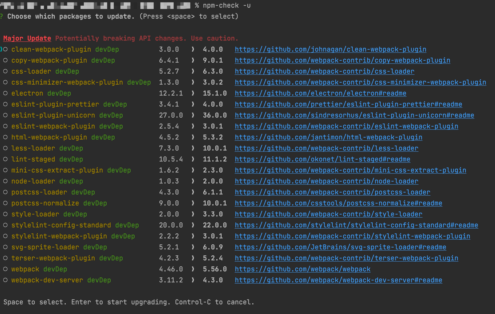

## 2.2 排查并解决异常

跟着后面链接查看了下，每个包的主版本升级都需要`webpack v5`，无脑全选直接升级，然后不管是 `yarn start` 或是 `yarn build` 都抛出了异常：

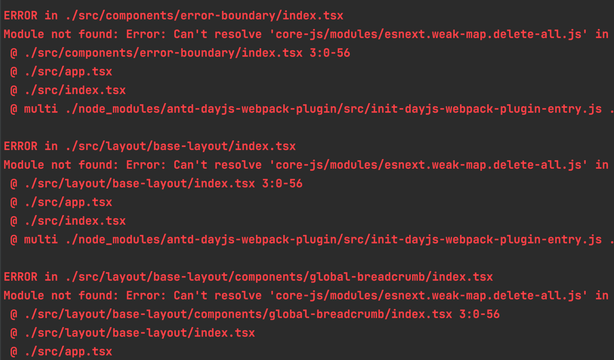

排查发现现有 `.babelrc.js` 配置在 `v5` 下需要 `core-js@3` ，不再需要 `@babel/runtime-corejs3` 这个包，那就替换之。

在之后抛出了如下`sourceMap`字段异常，类似的还有`cache`、`namedModules`、`noEmitOnErrors`等：

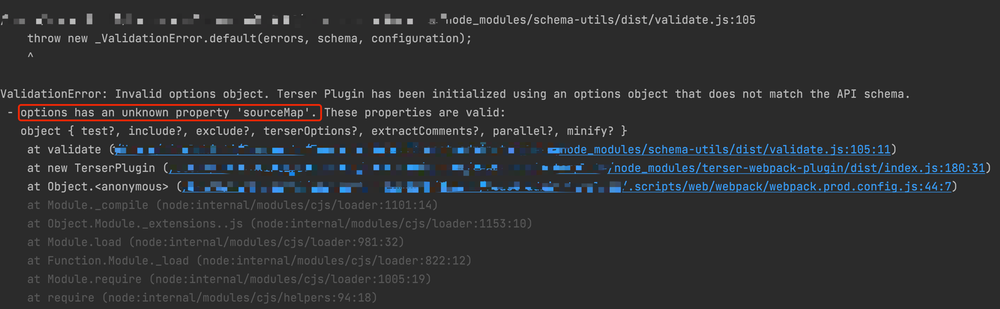

那就先跟着官方文档 [从 v4 升级到 v5](https://webpack.docschina.org/migrate/5/) 走查一遍吧，然后运行各个命令对遗漏项进行排查。

因为`DevServer`是使用`new WebpackDevServer(...)`的形式创建，顺便把抛出的两个警告也给解决了，一个是入参顺序，一个是启动方法，如下：

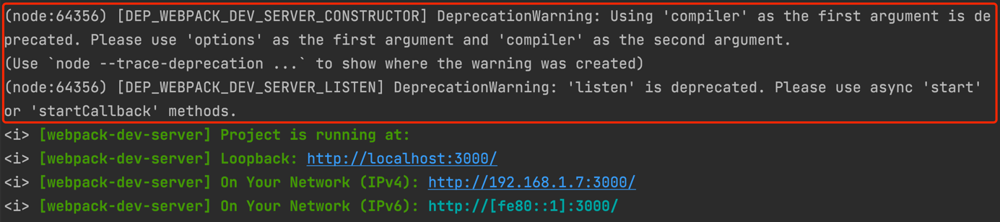

由于在 `v4` 的时候就做过优化，很多地方也为升级 `v5` 做了考虑，所以这里并没遇到什么阻力。

# 三、工具篇

俗话说，工欲善其事，必先利其器，知己知彼，方能百战不殆。既然要做优化，就要先知道哪里需要优化，指哪打哪精准命中。所以安装以下 `webpack` 插件帮助分析优化效率：

- [webpackbar](https://www.npmjs.com/package/webpackbar) or [progress-bar-webpack-plugin](https://www.npmjs.com/package/progress-bar-webpack-plugin) ：编译进度查看工具，推荐使用[webpack-bar](https://www.npmjs.com/package/webpackbar)
- [speed-measure-webpack-plugin](https://www.npmjs.com/package/speed-measure-webpack-plugin) ：编译速度分析工具
- [webpack-bundle-analyzer](https://www.npmjs.com/package/webpack-bundle-analyzer) ：包体积分析工具

## 3.1 编译进度查看

在大多项目中，大多项目启动或者打包时间基本 `30s` 起，有些项目首次启动会达到 `130s` 的惊人时长，有个进度条不仅方便掌握编译情况，也不至于等的那么焦急。
下面是两个插件的配置与输出对比，包含了进度条、进度百分比、模块数、消耗时间、当前编译的简略信息等，详细配置可去官方文档查看。

### 3.1.1 webpackbar

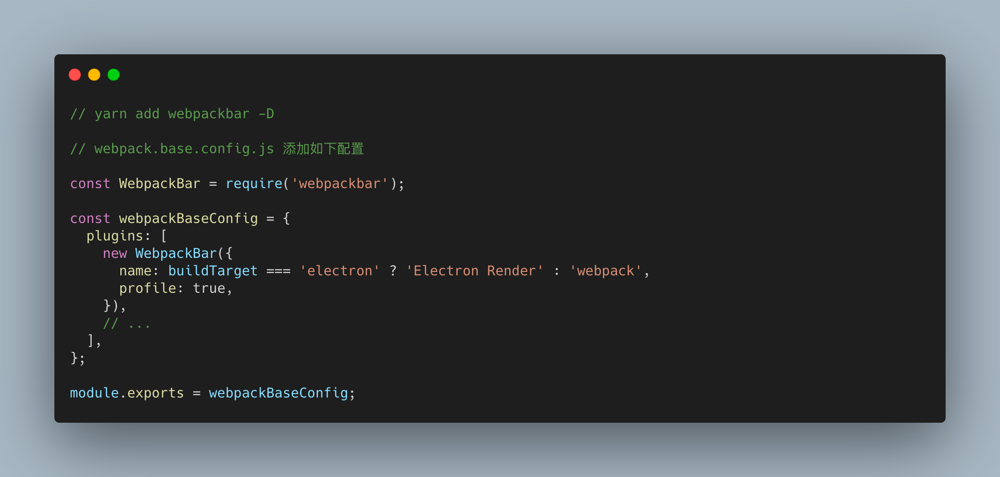
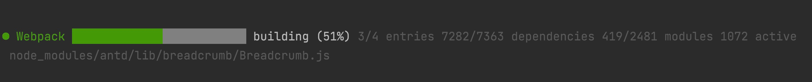

### 3.1.2 progress-bar-webpack-plugin

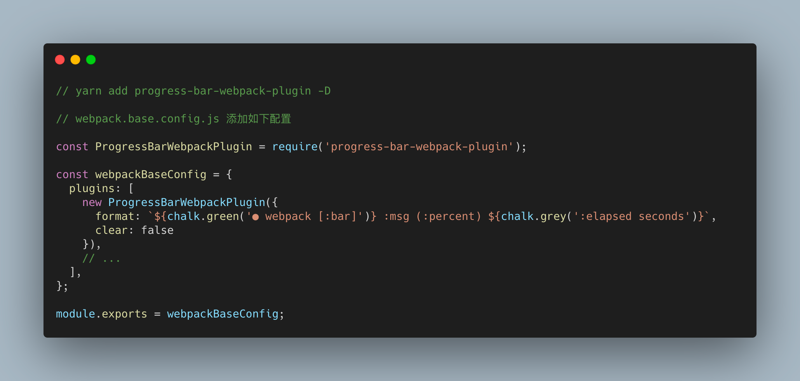


## 3.2 编译过程 Loaders、Plugins 耗时分析

若要优化 `webpack` 构建速度，首先还是要想办法拿到各个 `Loader`、`Plugin` 的耗时方可进行针对性优化。

本次借助插件 [speed-measure-webpack-plugin](https://www.npmjs.com/package/speed-measure-webpack-plugin) 进行构建速度分析，以查看各个 `Loader`、`Plugin` 的构建时长。

安装与配置

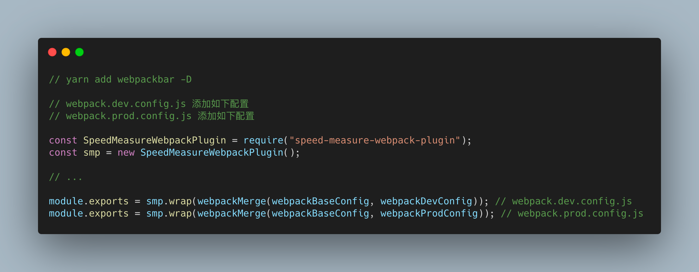

构建过程`Loaders`、`Plugins`耗时分析

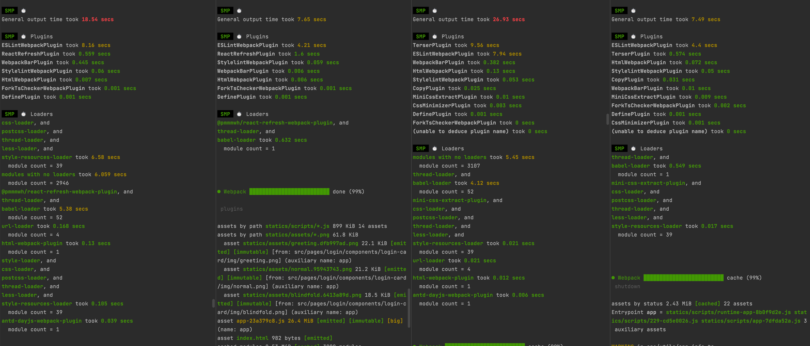

左一、左二分别为开发环境配置 `cache: { file: filesystem }` 前后的 `loader` 消耗对比，左三、左四分别为开发环境配置 `cache: { file: filesystem }` 前后的 `loader` 消耗对比。

遇到的问题：

在使用 `speed-measure-webpack-plugin` 后，`webpack.DllPlugin` 构建的 `dll` 的引用将会发生异常，会有一个 `dll_library is not defined` 的 `ReferenceError` 抛出。

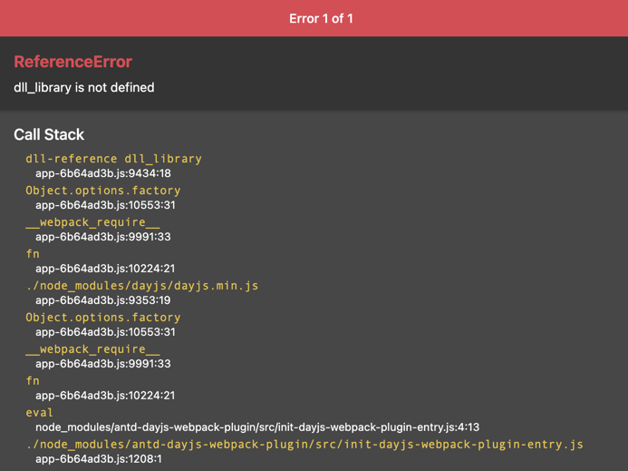

解决方案简单粗暴，因为 `dll` 构建是可选的，所以在分析构建速度时不构建 `dll`，同时在下文优化章节也会将 `webpack.DllPlugin` 的相关功能移除。


## 3.3 输出包体积分析

同上，若要优化 `webpack` 打包体积，首先还是要想办法拿到各个模块的输出分析数据。

本次借助插件 `webpack-bundle-analyzer` 进行构建输出分析，以查看各个模块的输出体积。

安装与配置

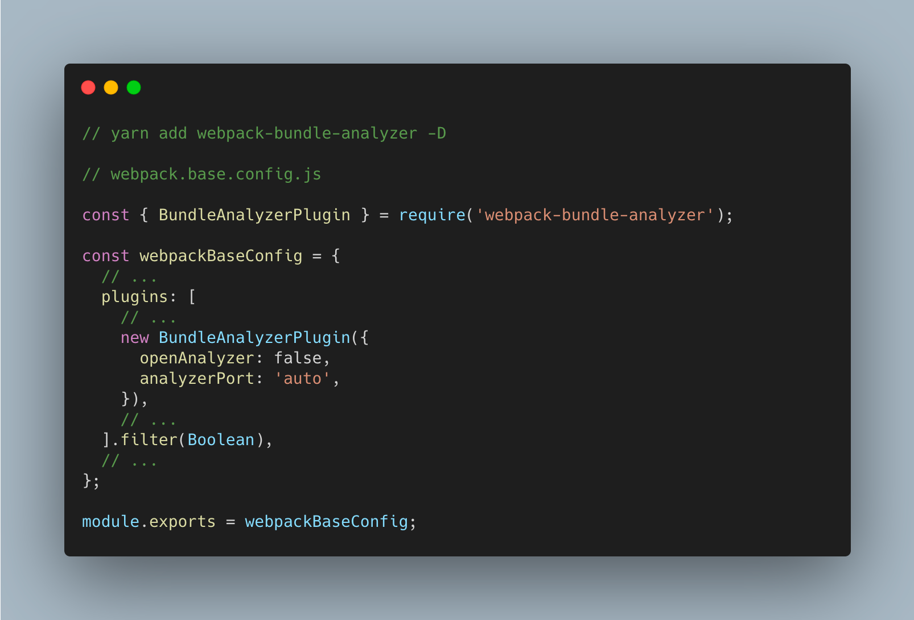

构建输出模块体积分析

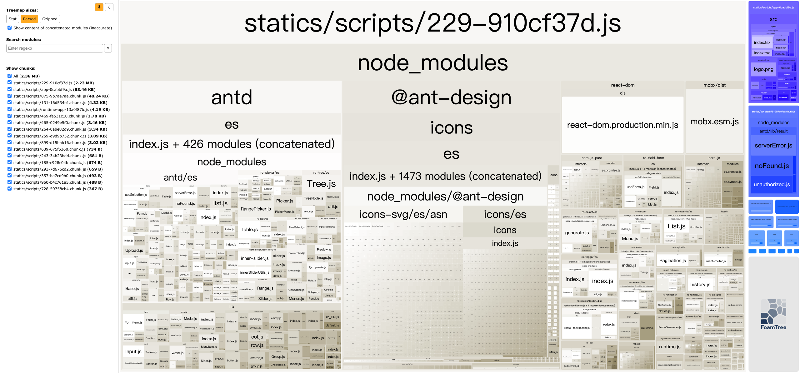

# 四、开发体验

## 4.1 自动更新

在项目开发的时候，修改代码无需手动再次编译，可以自动编译代码更新编译后代码的能力，无需在每次编译代码时，手动运行 `yarn dev` 这一麻烦的操作。

`webpack` 提供几种可选方式，帮助我们在代码发生变化后自动编译代码(摘自[webpack - 开发环境 - 选择一个开发工具](https://webpack.docschina.org/guides/development/#choosing-a-development-tool))

- [webpack's Watch Mode](https://webpack.docschina.org/configuration/watch/#watch)
- [webpack-dev-server](https://github.com/webpack/webpack-dev-server)
- [webpack-dev-middleware](https://github.com/webpack/webpack-dev-middleware)

本文所用项目在升级 `webpack v5` 之前使用的是 `webpack-dev-middleware`，现在使用的是 `webpack-dev-server`，这也是官方推荐的方式，配置见下文**模块热替换**部分。

## 4.2 模块热替换

> [模块热替换](https://webpack.docschina.org/concepts/hot-module-replacement/) (`HMR: hot module replacement`)功能会在应用程序运行过程中，替换、添加或删除 模块，而无需重新加载整个页面。 是 `webpack` 提供的最有用的功能之一。
它允许在运行时更新所有类型的模块，而无需完全刷新。

主要是通过以下几种方式，来显著加快开发速度：

- 保留在完全重新加载页面期间丢失的应用程序状态
- 只更新变更内容，以节省宝贵的开发时间
- 在源代码中 `CSS/JS` 产生修改时，会立刻在浏览器中进行更新，这几乎相当于在浏览器 `devtools` 直接更改样式

在 `webpack` 升级 `v5` 前，本文项目使用的是 `hot-loader@4.13.0`，在这里将使用 [React Fast Refresh](https://github.com/pmmmwh/react-refresh-webpack-plugin/#react-refresh-webpack-plugin) 功能实现。
`React Fast Refresh` 是 `React` 官方为 `React Native` 开发的模块热替换（`HMR`）方案，由于其核心实现与平台无关，所以也适用于 `Web` 平台项目。

使用 `webpack-dev-server` 内置的 `HMR` 插件，不再手动使用 `new webpack.HotModuleReplacementPlugin()` 的方式引入 `HMR` ， 最终 `dev.js`中配置如下：

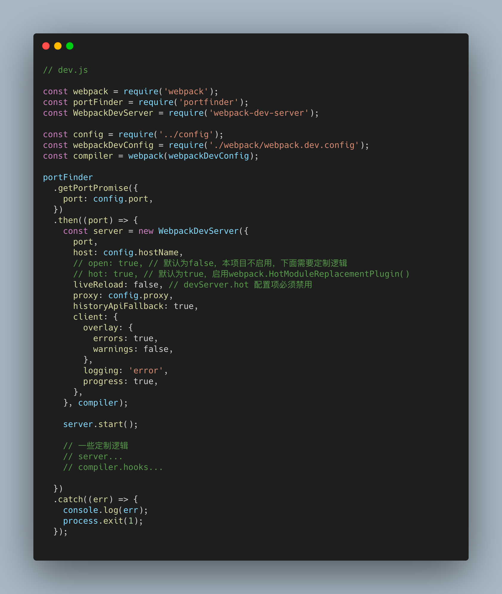

引入 [react-refresh-webpack-plugin](https://www.npmjs.com/package/react-refresh-webpack-plugin) 插件，`webpack.dev.config.js` 相关配置如下


最终效果是更新 `react` 组件相关代码时，仅更新组件部分，无需刷新整个页面。

# 五、构建速度

## 5.1 更新工具包版本

### 5.1.1 升级 `webpack` 版本，从 `v4` 到 `v5`

使用最新的 webpack 版本，通过 webpack 自身的迭代优化，来加快构建速度。

这一点还是非常有效的，如 `webpack v5` 较于 `webpack v4`，新增了持久化缓存、更好的算法和默认值改进长期缓存（`long-term caching`）、清理内部结构而不引入任何破坏性的变化等。

下图为升级 `webpack v5` 前后构建对比图：

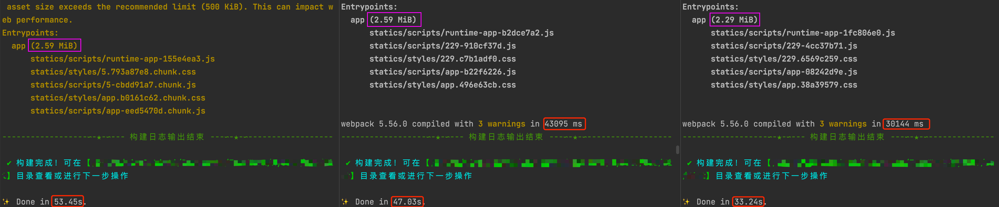

左：`webpack v4` 构建结果。中：升级 `webpack v5` 未修改非异常配置构建结果。右：优化之后首次构建结果。

从上图可以看出，本次优化效果还是比较明显，从最初的 `53.45s` 到 `47.03s` 再到 `33.24s`，首次构建提效 `38%` 左右。

### 5.1.2 更新 `node` 及 包管理工具(`yarn` 或 `npm`)版本

比如本文相关依赖升级如下

- `node@16.6.0`
- `npm@7.24.1`

这里有点个人主观意识，使用新版本的工具也有助于提高性能，较新的版本能够建立更高效的模块树以及提高解析速度，此处不做测试。

## 5.2 使用缓存

通过配置 `webpack` [重大变更：性能优化 - 持久化缓存](https://webpack.docschina.org/blog/2020-10-10-webpack-5-release/#major-changes-performance) `cache: { file: filesystem }`，来缓存生成的 `module` 和 `chunk`，以提高二次构建速度。

相关配置

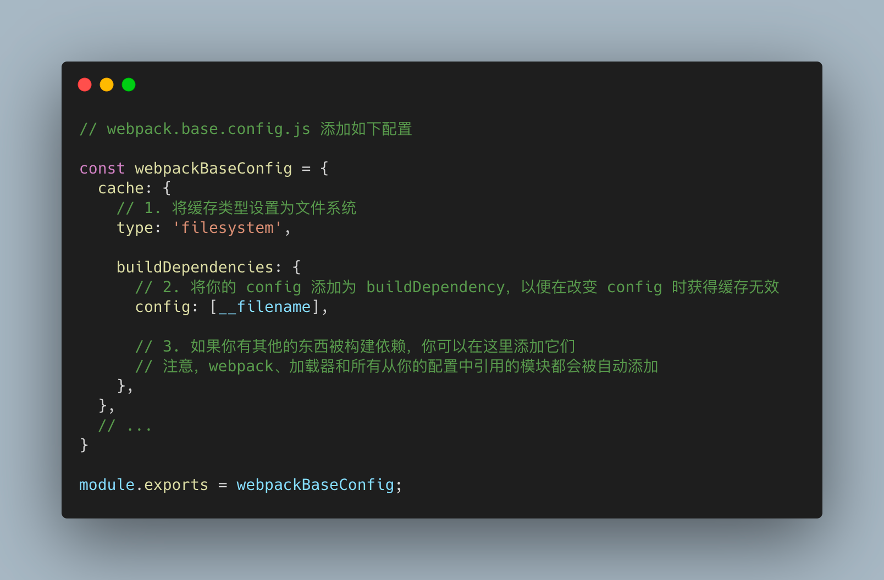

引入 `webpack v5` 提供的缓存功能后，测试了 **3** 个项目，首次构建时间约增加 `2% ~ 15%` 左右，二次构建时间约减少 `60% ~ 80%` 左右，本文使用项目效果如下：

开发环境启动前后对比：

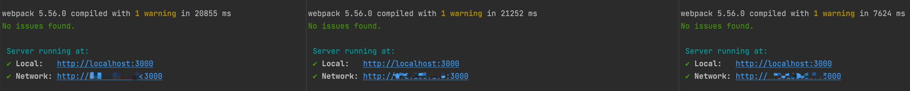

构建前后对比：

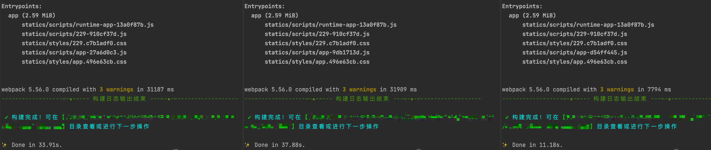

左：未配置 `cache: { file: filesystem }`；中：配置后第一次启动、构建；右：配置后二次启动、构建

简单来说，通过配置 `cache: { file: filesystem }` 可以将构建过程的相关产物在 `/node_modules/.cache/webpack` 下进行缓存(`default-development`、`default-production`)，
第一次启动、构建时长会有些许增加，但是二次构建时长会大幅减少，这个功能还是很香的哈。

## 5.3 cache-loader

`cache-loader` 主要是缓存目标loader的结果，且自身开销也挺大，其作者已经很久不再维护了，也推荐升级到 `webpack v5` 使用 `cache: { file: filesystem }` 来进行资源缓存。本项目在升级 `webpack v5` 前的优化中也已经将此 `loader` 删除。

## 5.4 DllPlugin

在 `webpack` 官网[构建性能 - dll](https://webpack.docschina.org/guides/build-performance/#dlls) 对此介绍如下：

> 使用 DllPlugin 为更改不频繁的代码生成单独的编译结果。这可以提高应用程序的编译速度，尽管它增加了构建过程的复杂度。

本文使用项目在升级 `webpack v5` 前采用如下配置：

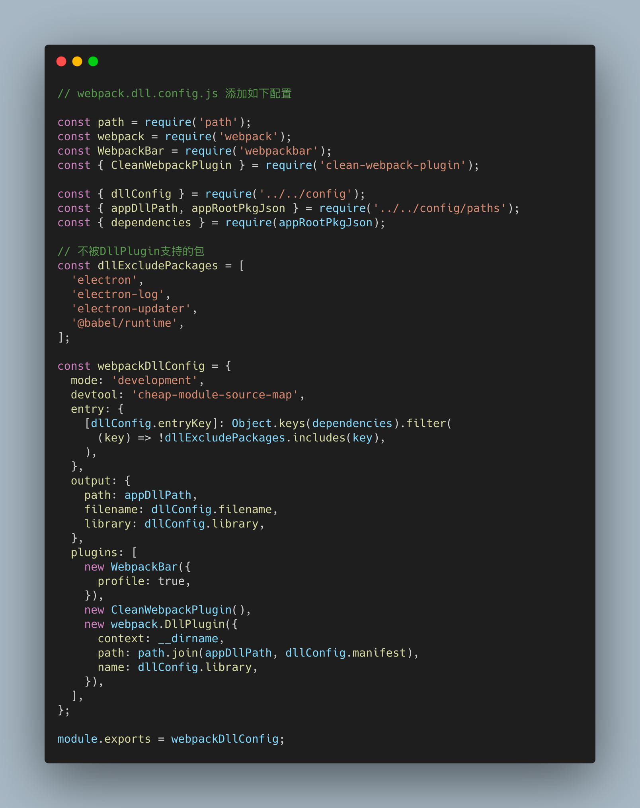

得到的优化效果如下：

> 不使用dll启动项目花费 `22235ms`；构建 `dll` 花费 `4.12s`，启动花费 `19053ms`。二次构建时长差不多减少 `15%` 左右。
> 和上面的 `cache: { file: filesystem }` 比起来，不仅配置麻烦，效果也不是那么香了，所以此功能在本次优化后也将被弃用。 

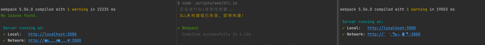

## 5.5 HardSourceWebpackPlugin

[HardSourceWebpackPlugin](https://github.com/mzgoddard/hard-source-webpack-plugin) 也是用来缓存模块的，我在两年前曾用此插件优化过项目，但是经常会出现文件失效的 `bug`，后来也就弃用了，这里也就不推荐了。当然有了 `webpack v5` 的 `cache`，也完全没有必要使用了。

## 5.6 减少不必要的leader、plugin，控制处理作用域

> 每个的 `loader`、`plugin` 的启动和处理也都或多或少消耗资源。所以尽量少地使用工具，大道至简，将非必须的 `loader`、`plugins` 移除。
> 同时控制每个 `loader` 的作用范围，避免不必要的工作带来时间上的消耗。

### 5.6.1 减少不必要的loader

使用 `webpack v5` [资源模块(asset module)](https://webpack.docschina.org/guides/asset-modules/) 代替 `assets loader`（如 `file-loader`、`url-loader`、`raw-loader` 等），以减少 `loader` 数量。

在 `webpack v5` 之前，通常使用：

- `raw-loader` 将文件导入为字符串
- `url-loader` 将文件作为 data URI 内联到 bundle 中
- `file-loader` 将文件发送到输出目录

资源模块类型(`asset module type`)，通过添加 4 种新的模块类型，来替换所有这些 `loader`：

- `asset/resource` 发送一个单独的文件并导出 `URL`。之前通过使用 `file-loader` 实现
- `asset/inline` 导出一个资源的 `data URI`。之前通过使用 `url-loader` 实现
- `asset/source` 导出资源的源代码。之前通过使用 `raw-loader` 实现
- `asset` 在导出一个 `data URI` 和发送一个单独的文件之间自动选择。之前通过使用 `url-loader`，并且配置资源体积限制实现

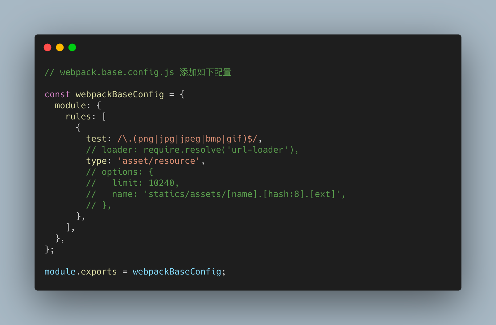

使用资源模块替换旧的 `loader` 之后，因为项目中图片并不多，构建时间将减少在 `5%` 左右：

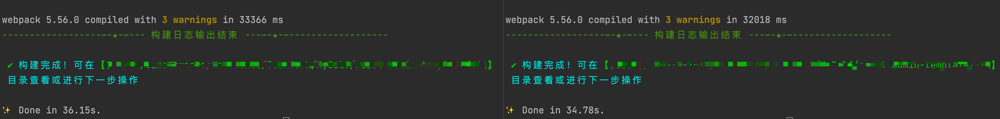

### 5.6.2 控制作用域

比如将 `loader` 应用于最少数量的必要模块，通过使用 `include` 字段，仅将 `loader` 应用在实际需要将其转换的模块；通过 `exclude` 字段，排除不需要转换的模块：

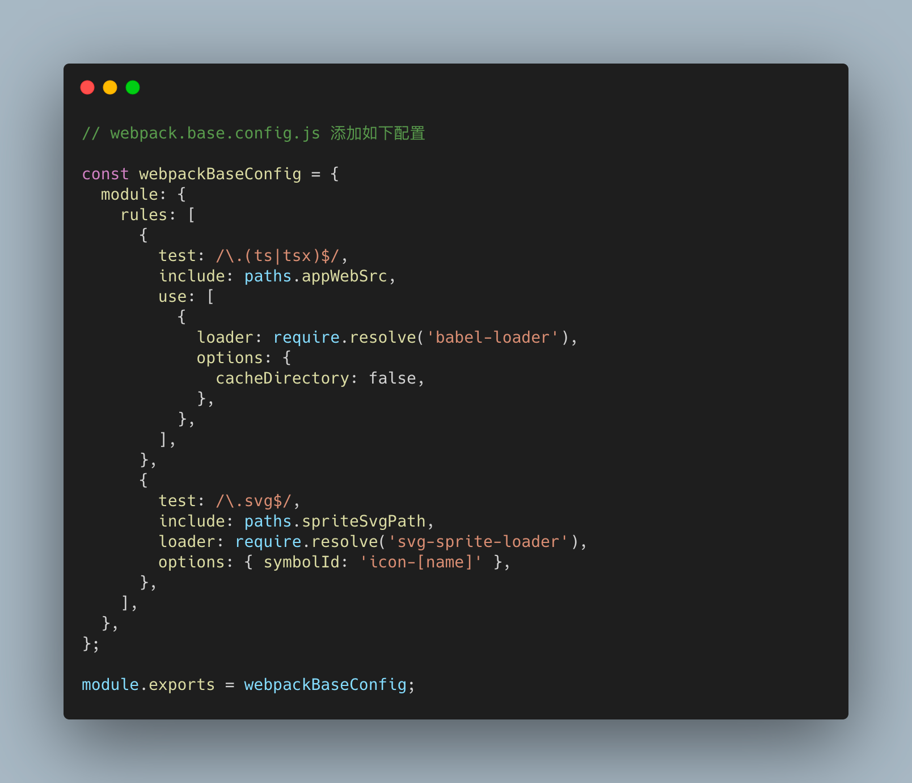

添加 `loader` 的 `include` 和 `exclude` 后，构建时间将减少 `24%` 左右，效果如下图：

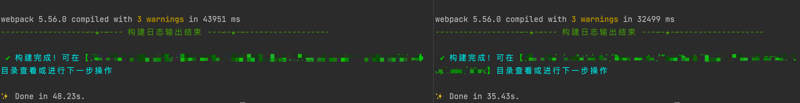

## 5.7 优化 resolve 配置

- 可通过 `resolve` 来配置 `webpack` 如何解析模块，减少解析范围，创建 `import` 或 `require` 的别名也可以让模块引入变得简单
- 通过 `extensions` 限制需要解析的文件类型列表，缩小解析范围，加快构建速度
- 对于业务项目，我们使用不到 `symlinks`(`npm link`、 `yarn link`)，可以设置 `resolve: { symlinks: false }` 减少解析工作量
- 参见 [解析(Resolve)](https://webpack.docschina.org/configuration/resolve/) 和 [模块解析(Module Resolution)](https://webpack.docschina.org/concepts/module-resolution/) 获取更多信息

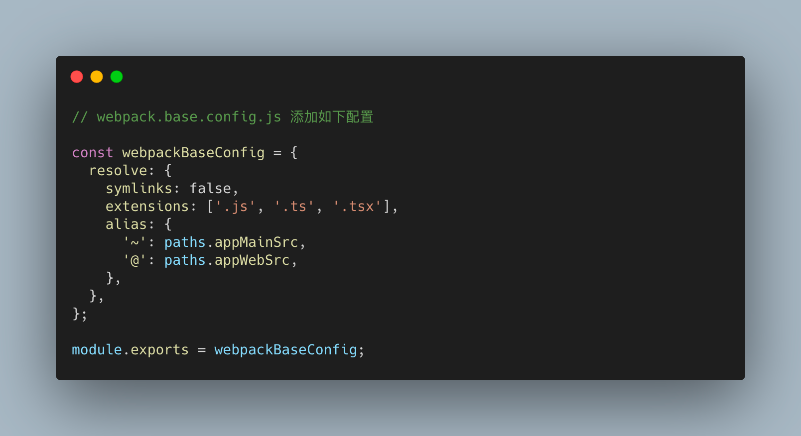

## 5.8 为 webpack 添加多线程能力

### 5.8.2 happypack

happypack 用来设置多线程，因为官方早就不维护了，所以这里不推荐使用了。

### 5.8.2 thread-loader

> 来自 `webpack` 官网：`node-sass` 中有个来自 `Node.js` 线程池的阻塞线程的 `bug`。 当使用 `thread-loader` 时，需要设置 `workerParallelJobs: 2`，因自己项目中没有使用 `sass`，所以不对此问题做测试。[传送门](https://webpack.docschina.org/guides/build-performance/#sass) 。

将耗时的 `loader` 放置在  [thread-loader](https://www.npmjs.com/package/thread-loader) 之后， 这些 `loader` 就会在一个单独的 `worker 池`(`worker pool`)中运行，加快 `loader` 构建速度。

在 `worker 池`(`worker pool`)中运行的 `loader` 是受到限制的。例如：

- 这些 loader 不能产生新的文件
- 这些 loader 不能使用定制的 loader API（也就是说，通过插件）
- 这些 loader 无法获取 webpack 的选项设置

每个 worker 都是一个单独的有 600ms 限制的 node.js 进程。同时跨进程的数据交换也会被限制。
所以请仅在耗时的 `loader` 上使用，可以通过上文提到的 [speed-measure-webpack-plugin](https://www.npmjs.com/package/speed-measure-webpack-plugin) 插件进行分析。

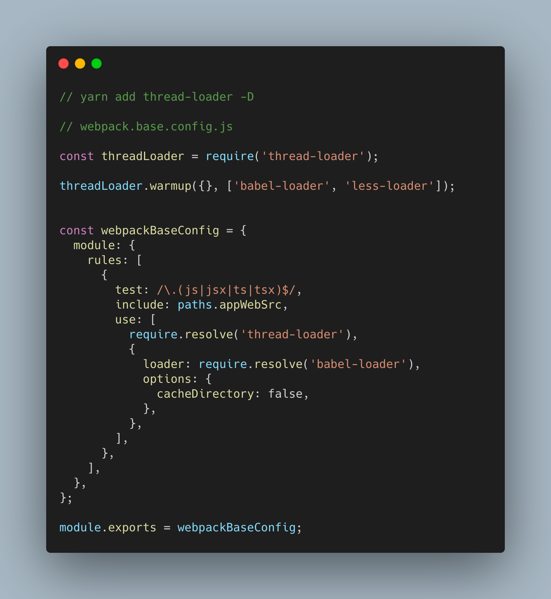

由于本文项目代码量不大，只处理了 `babel-loader` 和 `less-loader`， 加上其自身启动也要消耗时间，所以引入 `thread-loader` 后并没有特别明显的效果，大项目就显得格外明显了。
构建时间从 `32789ms` 到 `31296ms` 减少了 `1493ms`，约 `4.6%` 左右。

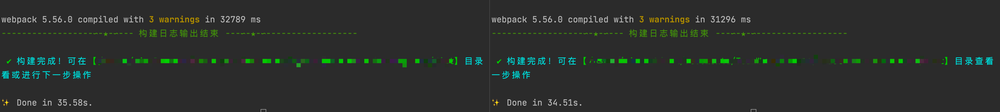

### 5.8.3 Fork TS Checker Webpack Plugin

> 插件 [fork-ts-checker-webpack-plugin](https://www.npmjs.com/package/fork-ts-checker-webpack-plugin) 会在一个独立的进程进行 TypeScript 类型检测。

- 开辟独立的进程对 TypeScript 类型校验和 Eslint linting 进行加速
- 支持 TypeScript 诸如 [Project References](https://www.typescriptlang.org/docs/handbook/project-references.html) 、 [incremental mode](https://www.typescriptlang.org/docs/handbook/release-notes/typescript-3-4.html#faster-subsequent-builds-with-the---incremental-flag) 的新特性。
- 支持 Vue Single File Component
- 友好的错误提示

项目内配置如下：

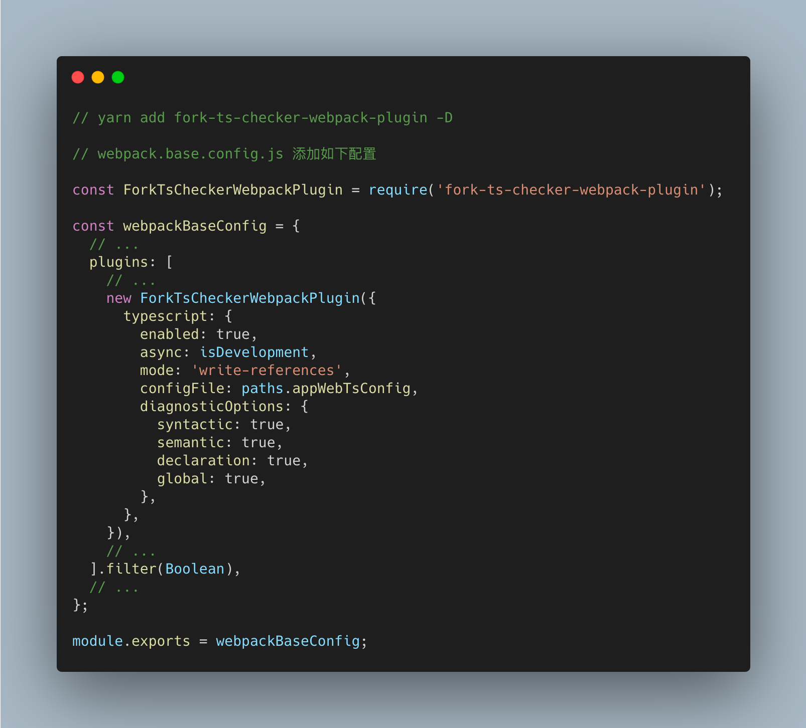

## 5.9 Devtool

> 需要注意的是不同的 `devtool` 设置，会导致性能差异，参见 [构建性能 - Devtool](https://webpack.docschina.org/guides/build-performance/#devtool)。

- `eval` 具有最好的性能，但并不能帮助你转译代码
- 如果你能接受稍差一些的 `map` 质量，可以使用 `cheap-source-map` 变体配置来提高性能
- 使用 `eval-source-map` 变体配置进行增量编译


## 5.10 区分环境，按需配置

**避免在开发环境使用生产环境才会用到的工具，反之亦然。**

在开发过程中，切忌在开发环境使用生产环境才会用到的工具。比如在开发环境下使用 `TerserPlugin` 来 `minify`(压缩) 和 `mangle`(混淆破坏) 代码是没有意义的。
同理，在生产环境，也应该避免使用开发环境才会用到的工具，如 `webpack-dev-server`、`webpack.HotModuleReplacementPlugin` 等插件。

通常在开发环境下，应该排除以下这些工具：

- `TerserPlugin`
- `[fullhash]/[chunkhash]/[contenthash]`
- `AggressiveSplittingPlugin`
- `AggressiveMergingPlugin`
- `ModuleConcatenationPlugin`

合理清晰的的组织 `webpack` 脚本显得尤为重要，下面是我的脚本目录组织结构：

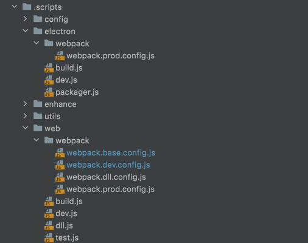

## 5.11 其他

### 5.11.1 输出结果不携带路径信息

`Webpack` 会在输出的 `bundle` 中生成路径信息。然而，在打包数千个模块的项目中，这会导致造成垃圾回收性能压力。在 `options.output.pathinfo` 设置中关闭。

```javascript
module.exports = {
  // ...
  output: {
    pathinfo: false,
  },
};
```

### 5.11.2 避免额外的优化步骤

`Webpack` 通过执行额外的算法任务，来优化输出结果的体积和加载性能。这些优化适用于小型代码库，但是在大型代码库中却非常耗费性能。

```javascript
module.exports = {
  // ...
  optimization: {
    removeAvailableModules: false,
    removeEmptyChunks: false,
    splitChunks: false,
  },
};
```

### 5.11.3 最小化 entry chunk

`Webpack` 只会在文件系统中输出已经更新的 chunk。某些配置选项（`HMR`, `output.chunkFilename` 的 `[name]/[chunkhash]/[contenthash]，[fullhash]`）来说，除了对已经更新的 `chunk` 无效之外，对于 `entry chunk` 也不会生效。

```javascript

module.exports = {
  // ...
  optimization: {
    runtimeChunk: true,
  },
};
```

# 六、包体积优化

## 6.1 代码压缩

### 6.1.1 `JS` 代码压缩

本文项目使用 [terser-webpack-plugin](https://www.npmjs.com/package/terser-webpack-plugin) 来压缩 `JavaScript` 代码。
我在两年前也曾用过 [uglifyjs-webpack-plugin](https://www.npmjs.com/package/uglifyjs-webpack-plugin) ，当初好像是因为 ES6 语法问题转向的 `TerserWebpackPlugin`，此文不再赘述。

`webpack v5` 开箱即带有最新版本的 `terser-webpack-plugin`。如果你使用的是 `webpack v5` 或更高版本，同时希望自定义配置，那么仍需要安装 `terser-webpack-plugin`。如果使用 `webpack v4`，则必须安装 `terser-webpack-plugin v4` 的版本。

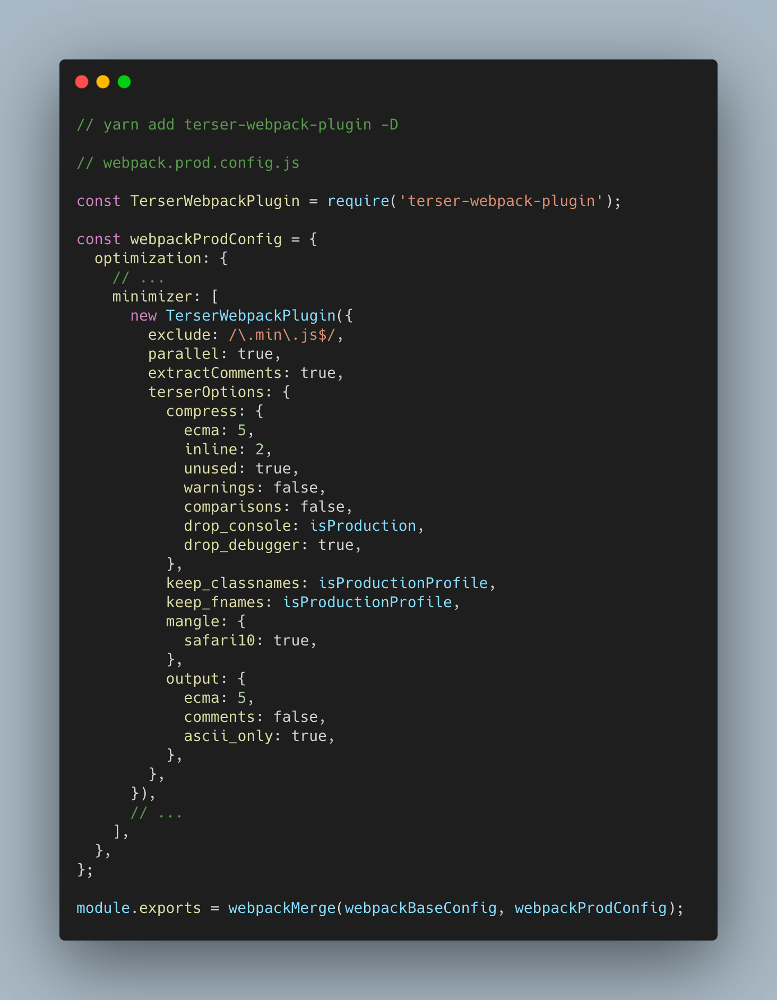

效果明显，体积从`5.69 MiB` 减小到 `2.59 MiB`，约减少 `60%` 左右的包体积，但是打包时间却有所增加，见下图。

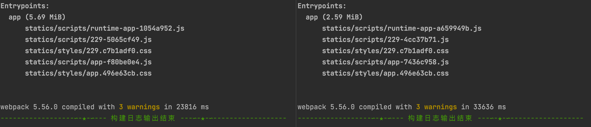

### 6.1.2 `CSS` 代码压缩

本文项目使用 [css-minimizer-webpack-plugin](https://www.npmjs.com/package/css-minimizer-webpack-plugin) 来压缩 `CSS` 代码。

> 与 [optimize-css-assets-webpack-plugin](https://www.npmjs.com/package/optimize-css-assets-webpack-plugin) 相比，[css-minimizer-webpack-plugin](https://www.npmjs.com/package/css-minimizer-webpack-plugin) 在 `source maps` 和 `assets` 中使用查询字符串会更加准确，而且还支持缓存和并发模式下运行。


项目 `CSS` 量小，体积从`2.68 MiB` 减小到 `2.59 MiB`，约减少 `4%` 左右的包体积，但是打包时间却有所增加，见下图。

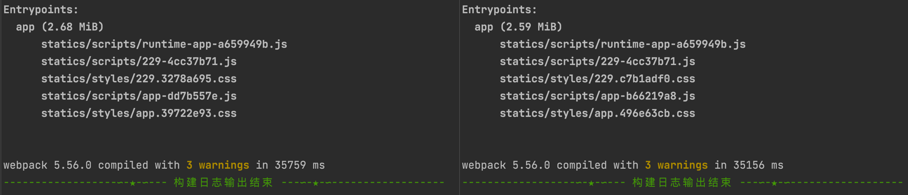

## 6.2 代码分离

### 6.2.1 `JS` 代码分离

代码分离是 `webpack` 中最引人注目的特性之一。此特性能够把代码分离到不同的 `bundle` 中，然后可以按需加载或并行加载这些文件。代码分离可以用于获取更小的 `bundle`，以及控制资源加载优先级，如果使用合理，会极大影响加载时间。点击 [传送门](https://webpack.docschina.org/guides/code-splitting/) 了解更多。

常用的代码分离方法有三种：

- 入口起点：使用 `entry` 配置手动地分离代码
- 防止重复：使用 `Entry dependencies` 或者 `SplitChunksPlugin` 去重和分离 `chunk`
- 动态导入：通过模块的内联函数调用来分离代码

开箱即用的 [SplitChunksPlugin](https://webpack.docschina.org/plugins/split-chunks-plugin/) 对于大部分用户来说非常友好。

默认情况下，它只会影响到按需加载的 `chunks`，因为修改 `initial chunks` 会影响到项目的 `HTML` 文件中的脚本标签。

`webpack` 将根据以下条件自动拆分 `chunks`：

- 新的 `chunk` 可以被共享，或者模块来自 `node_modules` 文件夹
- 新的 `chunk` 体积大于 20kb（在进行 `min+gz` 之前的体积）
- 当按需加载 `chunks` 时，并行请求的最大数量小于或等于 `30`
- 当加载初始化页面时，并发请求的最大数量小于或等于 `30`；通过 `splitChunks` 把 `react` 等公共库抽离出来，不重复引入占用体积

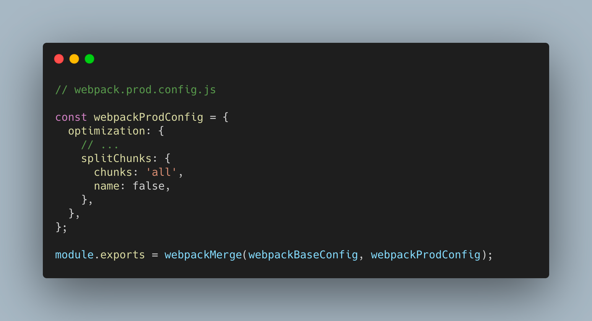

效果如下：

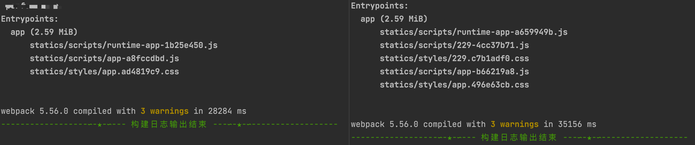

### 6.2.2 `CSS` 代码分离

[MiniCssExtractPlugin](https://www.npmjs.com/package/mini-css-extract-plugin) 插件将 `CSS` 提取到单独的文件中，为每个包含 `CSS` 的 `JS` 文件创建一个 `CSS` 文件，并且支持 `CSS` 和 `SourceMaps` 的按需加载。

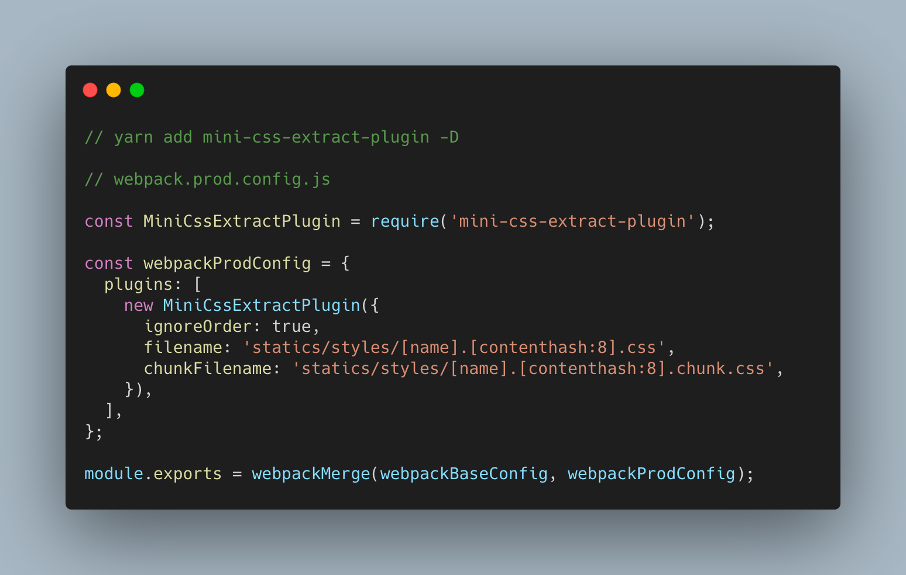

效果如下：

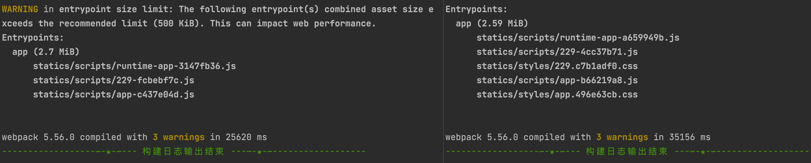

## 6.3 Tree Shaking

> [tree shaking](https://webpack.docschina.org/guides/tree-shaking/#mark-the-file-as-side-effect-free) 是一个术语，通常用于描述移除 `JavaScript` 上下文中的未引用代码(`dead-code`)。它依赖于 `ES2015` 模块语法的 静态结构 特性，例如 `import` 和 `export`。这个术语和概念实际上是由 `ES2015` 模块打包工具 `rollup` 普及起来的。

### 6.3.1 JS Tree Shaking

`Dead Code` 一般具有以下几个特征：

- 代码不会被执行，不可到达
- 代码执行的结果不会被用到
- 代码只会影响死变量（只写不读）

通过 `package.json` 的 `sideEffects` 属性或者在 `module.rules` 配置选项 中设置 `sideEffects` 作为标记，向 `compiler` 提供提示，表明项目中的哪些文件是 "`pure`(纯正 `ES2015` 模块)"，由此可以安全地删除文件中未使用的部分。

```json
{
  "name": "your-project",
  "sideEffects": false
}
```

需注意的是，当代码有副作用时，需要将 `sideEffects` 改为提供一个数组，添加有副作用代码的文件路径：

```json
{
  "name": "your-project",
  "sideEffects": ["./src/utils/load.ts"]
}
```

### 6.3.2 CSS Tree Shaking

本文项目使用 使用 [purgecss-webpack-plugin](https://www.npmjs.com/package/purgecss-webpack-plugin) 对 `CSS` 进行 `Tree Shaking`。

因为打包时 `CSS` 默认放在 `JS` 文件内，因此要结合 `webpack` 分离 `CSS` 文件插件 `mini-css-extract-plugin` 一起使用，先将 `CSS` 文件分离，再进行 `CSS Tree Shaking`。

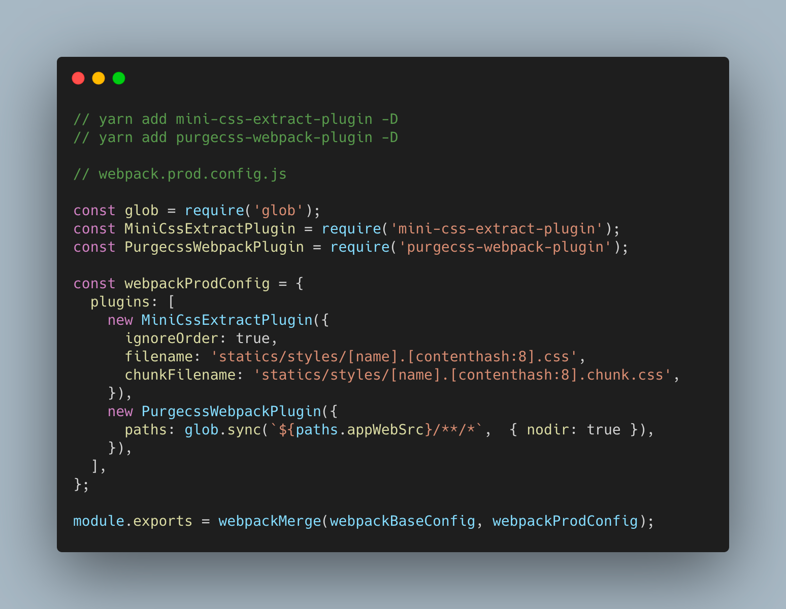

效果也非常明显包体积从 `2.59 MiB` 减少到 `2.29 MiB`，减少了约 `12%` 左右。

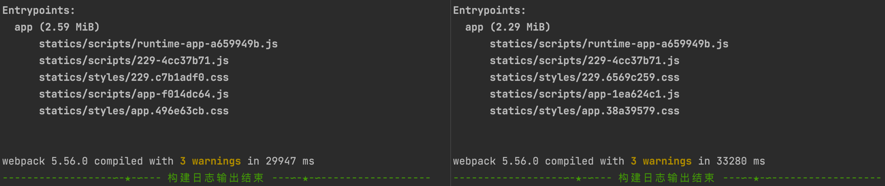

## 6.4 上传CDN

除了对 `webpack` 进行优化，还可以拆分出一部分大的静态资源上传至 `CDN`，并修改本地引入路径。

将大的静态资源上传至 `CDN`：

- 字体：压缩并上传至 `CDN`
- 图片：压缩并上传至 `CDN`
- 大体积公共依赖：`react`、`react-dom`等，压缩文件上传至 `CDN`


# 七、加载速度

## 7.1 按需加载

- 通过 `webpack` 提供的 `import()` 语法动态导入功能进行代码分离，通过按需加载，来提升网页加载速度
- `React` 项目可以使用 `React` 官方提供的 `React.Suspense` 和 `React.lazy` 实现按需加载
- `React` 项目可以使用 `@loadable/component`、`react-loadable` 等第三方库来实现路由级别的按需加载

## 7.2 浏览器缓存

> 鉴于强缓存、协商缓存、启发式缓存的八股文已经烂大街，本文不再赘述。

结合 `webpack` 提供的 `fullhash`、`chunkhash`、`contenthash` 以及 `MiniCssExtractPlugin` 提供的 `filename`、`chunkFilename` 等字段合理利用浏览器缓存。

## 7.3 上传CDN

将所有的静态资源，上传至 CDN，通过 CDN 加速来提升加载速度。将 `output.publicPath` 设置为 `CDN` 地址，打包完成再上传到对应 `CDN` 。

# 八、优化结果

## 8.1 构建速度

优化后二次启动速度大幅提升，见下图：

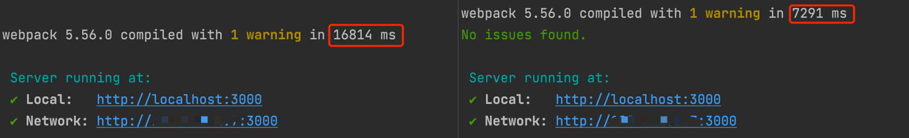

优化后二次构建速度大幅提升，见下图：

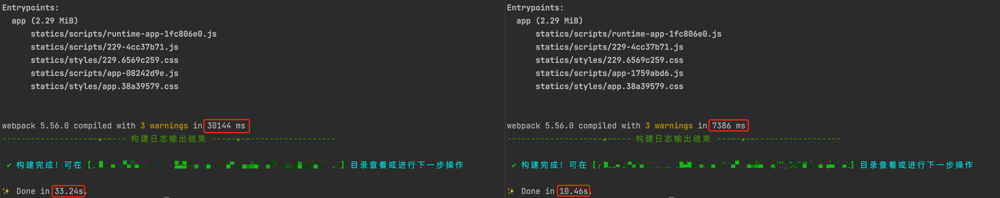

## 8.2 包体积

优化后包体积见下图：


# 九、结语

> 每次运行命令，打包时间会或多或少有点偏差，时间问题，并没有太多次运行取中间值。优化结果很明显，请勿对时间上细微的偏差较真。

从本次优化中，能明显感知到一个现象就是：在小型项目中，添加过多的优化配置，有时候非但作用不大，反而会因为过多的 `loader`、`plugin` 增加构建时间。
我一直秉承过早优化乃万恶之源的思想，在遇到瓶颈前的优化大多是徒劳的。但是这和我们作为一个精益求精的人并不冲突，所以即便是小项目，也要保持自己追求极致的态度。

希望本文对你有所帮助。**你看，来都来了，那就点个赞再走吧～**。